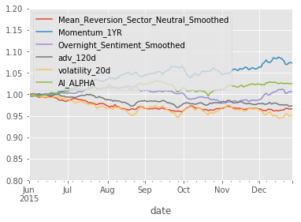
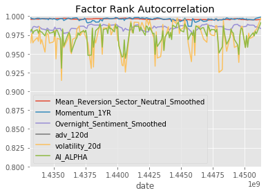

# Enhancing alpha combination using random forrest

Combine signals on a random forest for enhanced alpha while avoiding overlapping samples

Observed how building an ensemble of non-overlapping trees resulted in the most robust model performance. 

## Results from the final out-of-sample test-data

### Sharpe Ratios

|                                        | Sharpe Ratio   |
| -------------------------------------- | -------------- |
| Mean_Reversion_Sector_Neutral_Smoothed | -2.01000000    |
| Momentum_1YR                           | 2.60000000     |
| Overnight_Sentiment_Smoothed           | 0.33000000     |
| adv_120d                               | -1.57000000    |
| volatility_20d                         | -1.68000000    |
| **AI_ALPHA**                           | **1.20000000** |

Note how the AI_ALPHA has a reasonable sharpe, even though most of the alpha-factors have negative ratios!

### Final Factor Returns

### Final Autocorellations

